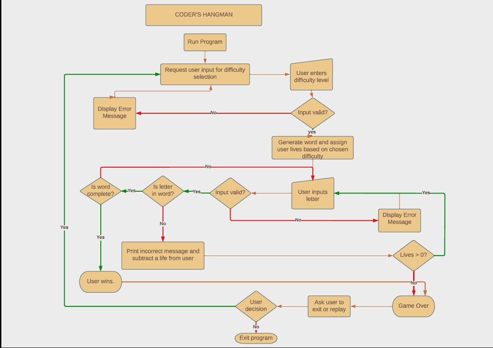

# **Coder's Hangman** 
 
## Purpose of the project
Coder's Hangman is a terminal based game designed to give students something fun, absorbing and easy to do while they take a quick break from coding. It also allows them to keep familiarising themselves with code-based vocabulary while they taking a break from actual coding.

Visit the live website here - [Coder's Hangman]().

## **Table of Contents**
 * [**Planning Stage**](#planning-stage)
   * User Goals
 * [**Features**](#features)
 * [**Technologies Used**](#technologies-used)
 * [**Libraries Used**](#libraries-used)
 * [**Testing**](#testing)
 * [**Bugs**](#bugs)
   * Fixed Bugs
   * Unfixed Bugs
 * [**Validators**](#validators)
 * [**Deployment**](#deployment)
 * [**Credits**](#credits)

## **Planning Stage**
### **Intended Users**
* The intended user is any student or programmer who needs to take a quick break from a piece of code that might be causing them problems.
* The user would rather take a quick micro-break from the code for a few mintues in order not to lose focus on the problem completely, but needs a bit of a reset in orde to focus on it. 

### **User Stories**
 * As a visiting user, I want to take a quick break at my computer that won't be too time-cosuming
 * As a visiting user, I want a game that is absorbing but not too challenging so I can relax. 
 * As a user, I would like the game to be somewhat relevant to my learning material so it can be helpful to my progress.

### **Site aims**
* To provide the user with an activity they can do to relax at their computer for a quick micro-break to aid productivity and creativity.
* To create an activity that allows the user to relax and improve their focus without being too stressful or high stakes. 
* To provide an activity which exposes the user to  terminology and vocabulary related to programming in order to help user retain information and vocabulary relevant to their learner goals.

 ### **FlowChart**
 The following flowchart acted as the blueprint for the game.
 I used this to visualize the steps as they would be required in the code. 

 

 ## **Features**

 ### **Existing Features**

* Set Difficulty
  * Easy = 9 lives
  * Normal = 7 lives
  * Hard = 5 lives

## **Future Features**
 
## **Testing**

## **Technologies Used**

## **Bugs**

### **Fixed Bugs**

### **Unfixed Bugs**

## **Validators**
* PEP8

## **Deployment**

* Steps to deploy:

## **Credits**
