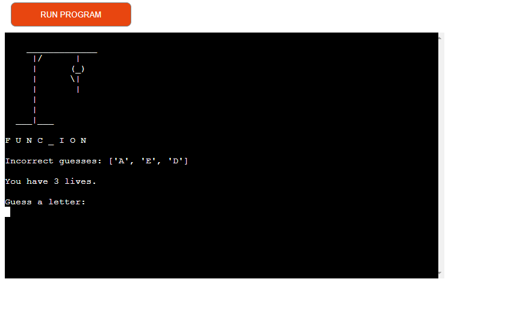
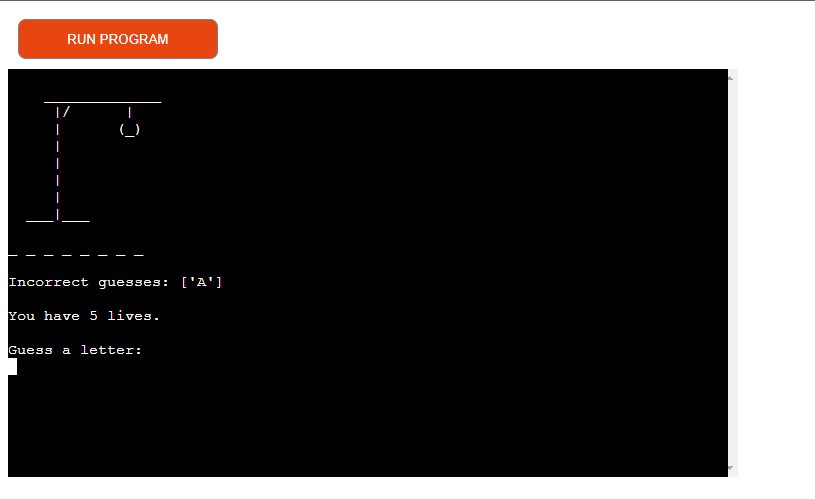

# **Coder's Hangman** 
 
## Purpose of the project
Coder's Hangman is a terminal based game designed to give students something fun, absorbing and easy to do while they take a quick break from coding. It also allows them to keep familiarising themselves with code-based vocabulary while taking a break from actual coding.

Visit the live website here - [Coder's Hangman](https://coders-hangman.herokuapp.com/).

## **Table of Contents**
 * [**Planning Stage**](#planning-stage)
 * [**Features**](#features)
 * [**Technologies Used**](#technologies-used)
 * [**Frameworks and Libraries**](#frameworks-and-libraries)
 * [**Testing**](#testing)
    * [**Validators**](#validators)
    * [**User Stories Testing**](#user-stories-testing)
    * [**Manual Testing**](#manual-testing)
    * [**Bugs**](#bugs)
 * [**Deployment**](#deployment)
 * [**Credits**](#credits)

## **Planning Stage**
### Intended Users
* The intended user is any student or programmer who needs to take a quick break from a piece of code that might be causing them problems.
* The user would rather take a quick micro-break from the code for a few mintues in order not to lose focus on the problem completely, but needs a bit of a reset in order to focus on it. 

### **User Stories**
 * As a visiting user, I want to play a game of hangman.
 * As a user I want to know how many letters are in the word.
 * As a user, I want to know whether my guess is correct and to see its position in the word. 
 * As a user, I want to know when my guess is incorrect.
 * As a user I want to know which letters I've already guessed.
 * As a user, I want to know how many lives I have left before I lose.

### **Site aims**
* To show the user a word with blank spaces indicating the number of letters.
* To inform the user when their guess is correct and display the letter in the correct position in the word.
* To inform the user when their guess is incorect and visually represent their incorrect guesses with the hangman.
* To display a list of previously guessed letters to the user.
* To inform the user how many lives they have left before each guess.

 ### **FlowChart**
 The following flowchart acted as the blueprint for the game.
 I used this to visualize the steps as they would be required in the code. 

 

 ## **Features**

 ### **Existing Features**
 ### Main Menu
 
 * The main menu will display a welcome message telling the user about coder's hangman and how to play. 
 * The user will be asked to press any key to start playing.

### The display

* The display shows the user an empty hangman and some dashes to represent the unknown word and its number of letters.
* The input instruction tells the user to guess a letter.

### Correct and Incorrect User Guesses

* The display will show the user the correctly guessed letters in their position in the word.

* When the user's guess is incorrect the hangman display will develop to indicate a life was lost.
* There will also be a life count on display at all times so the user can see exactly how many lives they have and when they lose a life.
* The incorrect letters that the user guesses  will also be displayed in a list immediately after they are guessed to indicate that the user's guess was wrong and also as a visual reminder of their previous guesses to avoid repitition.

### User wins

* When the user guesses all the correct letters in the word the word, will be displayed in full.
* A message informing the user they won will be displayed along with a message indicating the full word.

### User Loses

* If the user runs out of guesses before they guess the word, the full hangman image will be displayed.
* A consolidation message informing the user that they lost will also be displayed.

### Replay function
* Once the user has either won or lost the game, they will be invited to input Y to play again or N to exit.
* If the user inputs Y, the game display will be shown with a different word represented by dashes.

* All game features, including lives correct and incorrect guess lists and hangman display will be reset to the default game settings.
* If the user inputs N, there will be a goodbye message and the program will exit.

### The Input Validation
* User is informed when their input is invalid and asked to resubmit there input.
* For more details on how the app handles data validation, see  [**Manual Testing**](#manual-testing) section.

## **Future Features**
### Set Difficulty
* Allow user to select game difficulty in the main menu before the game starts and increase or decrease lives according to their chosen difficulty.
  * Easy = 9 lives
  * Normal = 7 lives
  * Hard = 5 lives
### Guess entire word
* Add a feature where the user can guess the word as well as individual letters. 
### Score system and database
* Ask user to input name.
* Allocate a score based on no. of user wins.
* Use Google Sheets and API to store and display a leaderboard to users.

## **Technologies Used** 
### Languages 
* Python
### **Frameworks and Libraries**
* [Github](https://github.com/)
* [Gitpod](https://gitpod.io/)
* [Heroku](https://www.heroku.com/)
* [lucidchart](https://www.lucidchart.com/pages/)
* [Ascii.co.uk](https://ascii.co.uk/art/hangman)
* [PEP8](http://pep8online.com/)
## **Testing**
### PEP 8 Online
## **Validators**
The [PEP8](http://pep8online.com/) Validator Service was used to validate every Python file in the project to ensure there were no major errors in the code.

Initial tests showed no errors for the word.py file contiaining the word list for hangman, but quite a few errors for the main run.py file. Most of these were easliy fixed blank space errors or blank line errors and amounted to no significant problems running the code. 
### run.py Initial Report

### hangman.py Initial Report

* In the final PEP8 reports, no errors were found in any of the files.

### run.py file Final Test

### words.py file

### hangman.py file Final Test

### **User Stories Testing**
1. As a visiting user, I want to play a game of hangman.
    * Once the program starts running, the user will see a welcome message explaining the game and the rules and inviting them to press the enter key if they wish to start playing.  
2.  As a user I want to know how many letters are in the word.
    * After clicking the enter key, the terminal will display a set of dashed lines to represent the letters of the word they need to guess. 
    * A hangman image without the man will also be displayed as well as a an input invitation for the user to "Guess a letter".
3.  As a user, I want to know whether my guess is correct and to see its position in the word.
    * When the user guesses a letter correctly it will be displayed in it's correct position instead of the dashed lines. 
4. As a user, I want to know when my guess is incorrect.
    * When the user guesses a letter that is not in the word it will be displayed in the incorrect guesses list.
    * The user will also be able to see their lives being reduced with each incorrect guess both by the hangman display and the message counting the number of lives for the user.
5. As a user I want to know which letters I've already guessed.
    * The Incorrect letters list will always be displayed to the user throughout the game.
    * The correct letters will be displayed in the word alongside dashed lines for unguessed letters. 
6. As a user, I want to know how many lives I have left before I lose.
    * The lives will be visually represented by the hangman image which will be displayed for the duration of the game.
    * The lives will also be displayed to theuser numerically in a print statement for the duration of the game.

### **Manual Testing**
1. User input - check for valid user inputs and if not valid ensure the appropriate error message is shown.
    * Ensure error message displays when user enters too many or not enough characters.

    
    
    * Ensure error message informs user that they must choose a letter when they choose a non- alphabetic character.

     

    * Ensure error message informs user when they repeat a guess.

    
    * Check for user validation message for replay game function if the user doesn't input either Y or N. 
    
    
    

    * Check that terminal clears after each user input and only displays the currect relevant information to the user. 
2. Score
    * Ensure that lives and guessed letter lists are not affected by incorrect user input or repeated guesses.

    
    * Ensure that hangman display matches lives count. 
    * Ensure that previously guessed letters are added to the correct lists and displayed to the user accordingly.

## **Bugs**

### **Fixed Bugs**
I have detailed some of the sources I used to fix bugs in the Credit section. Some of the main issues that were resolved were:
1. In the restart_game function I was initially using break to stop the while loop and exit the user from the program. However, the goodbye message wasn't showing and the program stopped quite suddenly. I found some articles which suggested using sys.exit() would be better for exiting the program so implemented it and that also solved the issue with the goodbye message. 

Source: [stack overflow](https://stackoverflow.com/questions/14639077/how-to-use-sys-exit-in-python)
 

2. I had a lot of issues with the diplay_word function which wasn't correctly displaying the random word for the hangman game or the user's guesses in the random word.
    * By looking through the problems in the gitpod  terminal, I was able to see that I had named variable that weren't being used in the function. I was trying to use the user_guess variable in the for loop but it ended up causing an error. 
    * Once I started to use a local variable "letter" it worked. 

3. Another bug was that the user's guesses were decrementing the lives even when they were repeat guesses.
    * I had to watch through some youtube videos and in the end I ended up making global variables to store these values in so that they would be accessible from all the functions. And used the append() method to add the user guesses.

4. I wanted to use os.system("clear") to keep the terminal clean and readable. I initially put it after the check_game_over function call in the main() function. However this led to all the display being cleared and I wanted the hangman, word, guesses and lives to alway be displayed to the user.
    * I had to do a lot of testing about where to use os.system("clear") and when to call the display functions. Eventually I got it displaying exactly as I want except for one small detail which is in the unfixed bugs section.

5. An error message displayed the first few attempts I made at deployment. The error message was: can't open file '/app/run.py': [Errno 2] No such file or director.
    * I did an initial search and found a lot of quite dense content so I decided to try some simple things before asking for help.
    * I noticed the file name in the error message was run.py and I had named my file hangman.py, so I thouht I might have broken the naming convention for the primary python file. I renamed it and saved, commited and pushed to gitpod.
    * I tried deploying again. Perhaps too quickly because I got the same error.
    * Finally I tried and deployed enabling automatic deployment and it worked. 

### **Unfixed Bugs**
1. In the validate_user_input function, I initially had some feedback that displayed a message to tell the user their guess was correct or incorrect. At first this displayed just fine, albeit above the hangman, not below where I would have liked. After implementing os.system("clear") these messages stopped displaying and I was unable to find a way to display them without getting rid of the clear method. 

    * In the end, I prefer to have the terminal cleared at each step as it looks more readable and clear for the user. The user's guess is clearly displayed after each input and there are multiple ways that they can read their guesses as being correct or incorrect without the written message, ie. the hangman, the lives count the correct letters and incorrect letters list. So I decided to keep the clear method active instead. 
2. The code works exactly as I want it to. However it could use some refactoring and simplifying as some problems were solved as I went along and looking back over the code there are a lot of repeated instructions.    

## **Deployment**

### Steps to deploy:

#### **Gitpod**

1. Create a repository in github using the [Code Institute template](https://github.com/Code-Institute-Org/python-essentials-template). 
2. Click Use this Template and add a repository name.
3. Click Create Repository from template
4. While using this template ensure all inputs have \n to ensure deployment to heroku.
5. In terminal type pip3 freeze > requirements.txt press enter to update this file.
6. Add , commit and push all changes to github before starting steps to deploy to Heroku

#### **Heroku**
1. Log in to [Heroku](https://id.heroku.com).
2. From the dashboard, click the button labelled New in the top right corner and from the drop-down menu select Create New App.
3. Enter a name for the app and select your region.
4. Click Create App.                  
5. Find the Settings Tab and scroll down to Config Vars.
6. Click Reveal Config Vars and enter PORT into the Key box and 8000 into the Value box before clicking Add. 
7. Scroll down to the Buildpack section click Add Buildpack.
8. Select python and click Save Changes.
9. Next select node.js and Save Changes. 
10. Ensure python is the first buildpack listed and is above node.js.
11. Scroll to the top of the page and navigate to the Deploy tab.
12. Select Github as the deployment method.
14. Search for the repository name and click the connect button.
15. Scroll to the bottom of the deploy page and select Enable Automatic Deploys. 

## **Credits**
I used the following resources to help me plan, build and fix bugs in my project.

* [How to Build a Hangman Game with Python](https://www.youtube.com/watch?v=JNXmCOumNw0&ab_channel=CBTNuggets) : 
This video was useful to see a very basic version of the code needed without much frills and styling. The method to display the guessed and unguessed letters using a for loop to iterate through the word was really useful in particular.

* [Python Hangman Beginner to Advanced](https://www.youtube.com/watch?v=3_CX0aD9Fdg&ab_channel=SanjinDedic) : 
This video was also useful to see the process of making a very simple game and then gradually adding more features to make it more user friendly and interesting. I particularly liked that the vlogger used os.system("clear") to clear the terminal after each user action, making the terminal less cluttered and more readable.

* [12 Beginner Python Projects - Coding Course](https://www.youtube.com/watch?v=8ext9G7xspg&ab_channel=freeCodeCamp.org):
This video helped me to research project ideas and eventually choose hangman for my project. The hangman demonstration in this video clearly showed me the basic idea and blueprint of the code I would need and that it was as simple as importing a word list from anohter py file and using the  random module to generate a word from that list. 
* [Python Basics Project Assignment: How To Create Hangman in under 10 minutes!](https://www.youtube.com/watch?v=ynwB-QfOPRw&ab_channel=ShaunHalverson):
The approach in this video became the main blueprint for my own approach to building a hangman app. I didn't want to write my code all in one or two very comlpicated functions, but rather wanted to write smaller pieces of simple code in clearly labelled functions so that it would be more readable for me and anyone else who would need to read the code. I also wanted to challenge myself by calling the different functions at when needed in the code. 

* [How to build HANGMAN with Python in 10 MINUTES](https://www.youtube.com/watch?v=m4nEnsavl6w&ab_channel=Kite):
This video was very clear and helped clarify some of the methods for building the game so that I could approach it in a more independent way. I also saw the basic structure for a replay_game function in this video and was able to use that as my starting point for building that function.  

### Websites:
I used the following website pages to help me make a list of some programming related terminology for the hangman word list. 

[Python related vocab](https://www.pythonforbeginners.com/python-glossary)

[w3schools python glossary](https://www.w3schools.com/python/python_ref_glossary.asp)

I took the hangman art design from this page: 

[Ascii.co.uk](https://ascii.co.uk/art/hangman)

### Articles
The following articles helped me to understand and apply certain features and concepts.
* [w3schools: Lists](https://www.w3schools.com/python/python_lists.asp)

* [Programmiz.com: List append()](https://www.programiz.com/python-programming/methods/list/append)

* [Stack Overflow: Trying to re-loop a game](https://stackoverflow.com/questions/35069757/trying-to-re-loop-a-game-only-if-a-user-says-to)

* [Codefather: ](https://codefather.tech/blog/if-name-main-python/)

* [Programmiz.com: break and continue](https://www.programiz.com/python-programming/break-continue)

* [Free Code Camp: How to Write Good Commit Messages: A Practical Git Guide](https://www.freecodecamp.org/news/writing-good-commit-messages-a-practical-guide/)

